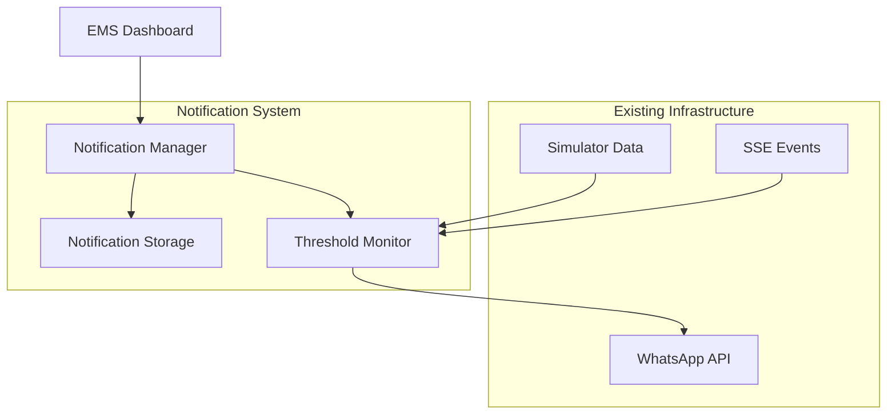

# WhatsApp Notifications Design Document

## Overview

The WhatsApp Notifications system extends the existing EMS platform to provide automated WhatsApp alerts based on energy usage thresholds. The system leverages the existing WhatsApp API integration and builds upon the current simulator-based architecture to deliver real-time notifications when energy consumption reaches configured percentage thresholds.

## Architecture

### High-Level Architecture



### Integration Points

1. **WhatsApp API Integration**: Utilizes existing `sendWhatsAppMessage` function from `src/lib/whatsapp-api.ts`
2. **Real-time Data**: Integrates with existing SSE events (`block-update` type) for real-time threshold monitoring
3. **Simulator Context**: Leverages existing `Simulator` type and `percent_of_target` calculations
4. **UI Framework**: Extends existing dashboard components and UI patterns

## Components and Interfaces

### 1. Notification Configuration Types

```typescript
export type NotificationTrigger = {
  id: string;
  simulatorId: string;
  phoneNumber: string;
  thresholdPercentage: number;
  isActive: boolean;
  createdAt: string;
  updatedAt: string;
};

export type NotificationHistory = {
  id: string;
  triggerId: string;
  simulatorId: string;
  phoneNumber: string;
  thresholdPercentage: number;
  actualPercentage: number;
  sentAt: string;
  success: boolean;
  errorMessage?: string;
};

export type NotificationSettings = {
  cooldownMinutes: number; // Prevent spam notifications
  maxDailyNotifications: number;
  enabledGlobally: boolean;
};
```

### 2. Notification Manager Service

```typescript
class NotificationManager {
  // Core notification logic
  async createTrigger(trigger: Omit<NotificationTrigger, 'id' | 'createdAt' | 'updatedAt'>): Promise<NotificationTrigger>
  async updateTrigger(id: string, updates: Partial<NotificationTrigger>): Promise<NotificationTrigger>
  async deleteTrigger(id: string): Promise<void>
  async getTriggersBySimulator(simulatorId: string): Promise<NotificationTrigger[]>
  
  // Threshold monitoring
  async checkThresholds(simulatorId: string, currentPercentage: number): Promise<void>
  async sendNotification(trigger: NotificationTrigger, currentPercentage: number): Promise<boolean>
  
  // History and settings
  async getNotificationHistory(simulatorId: string): Promise<NotificationHistory[]>
  async updateSettings(settings: Partial<NotificationSettings>): Promise<NotificationSettings>
}
```

### 3. Storage Layer

```typescript
interface NotificationStorage {
  // Trigger CRUD operations
  saveTrigger(trigger: NotificationTrigger): Promise<void>
  getTrigger(id: string): Promise<NotificationTrigger | null>
  getTriggersBySimulator(simulatorId: string): Promise<NotificationTrigger[]>
  updateTrigger(id: string, updates: Partial<NotificationTrigger>): Promise<void>
  deleteTrigger(id: string): Promise<void>
  
  // History tracking
  saveNotificationHistory(history: NotificationHistory): Promise<void>
  getNotificationHistory(simulatorId: string, limit?: number): Promise<NotificationHistory[]>
  
  // Settings management
  getSettings(): Promise<NotificationSettings>
  updateSettings(settings: Partial<NotificationSettings>): Promise<void>
  
  // Cooldown tracking
  getLastNotificationTime(triggerId: string): Promise<Date | null>
  setLastNotificationTime(triggerId: string, time: Date): Promise<void>
}
```

### 4. UI Components

```typescript
// Main notification management interface
export function NotificationManager({ simulatorId }: { simulatorId: string })

// Individual trigger configuration
export function TriggerForm({ 
  trigger?: NotificationTrigger, 
  onSave: (trigger: NotificationTrigger) => void,
  onCancel: () => void 
})

// List of configured triggers
export function TriggerList({ 
  triggers: NotificationTrigger[], 
  onEdit: (trigger: NotificationTrigger) => void,
  onDelete: (id: string) => void,
  onToggle: (id: string, active: boolean) => void 
})

// Notification history display
export function NotificationHistory({ simulatorId: string })

// Global settings panel
export function NotificationSettings()
```

## Data Models

### Database Schema (Local Storage Implementation)

```typescript
// LocalStorage keys structure
const STORAGE_KEYS = {
  TRIGGERS: 'notification_triggers',
  HISTORY: 'notification_history', 
  SETTINGS: 'notification_settings',
  COOLDOWNS: 'notification_cooldowns'
} as const;

// Default settings
const DEFAULT_SETTINGS: NotificationSettings = {
  cooldownMinutes: 15,
  maxDailyNotifications: 10,
  enabledGlobally: true
};
```

### Message Template

```typescript
const createNotificationMessage = (
  simulatorName: string,
  currentPercentage: number,
  thresholdPercentage: number,
  targetKwh: number,
  accumulatedKwh: number
): string => {
  return `🚨 EMS Alert: ${simulatorName}
  
Current Usage: ${currentPercentage.toFixed(1)}% of target
Threshold: ${thresholdPercentage}%
Target: ${targetKwh} kWh
Current: ${accumulatedKwh.toFixed(2)} kWh

Time: ${new Date().toLocaleString()}`;
};
```

## Error Handling

### Validation Rules

1. **Phone Number Validation**:
   - Must be in international format (e.g., +60123456789)
   - Must be 10-15 digits after country code
   - Must be WhatsApp-enabled (validated via API status check)

2. **Threshold Validation**:
   - Must be between 1% and 200%
   - Must be numeric value
   - Cannot have duplicate thresholds for same simulator/phone combination

3. **Rate Limiting**:
   - Cooldown period between notifications (default: 15 minutes)
   - Daily notification limits per trigger (default: 10)
   - Global enable/disable switch

### Error Recovery

```typescript
enum NotificationError {
  WHATSAPP_API_UNAVAILABLE = 'WHATSAPP_API_UNAVAILABLE',
  INVALID_PHONE_NUMBER = 'INVALID_PHONE_NUMBER',
  RATE_LIMIT_EXCEEDED = 'RATE_LIMIT_EXCEEDED',
  STORAGE_ERROR = 'STORAGE_ERROR',
  VALIDATION_ERROR = 'VALIDATION_ERROR'
}

interface ErrorHandler {
  handleWhatsAppError(error: Error, trigger: NotificationTrigger): Promise<void>
  handleValidationError(error: ValidationError): void
  handleStorageError(error: Error): void
  retryFailedNotification(historyId: string): Promise<boolean>
}
```

## Testing Strategy

### Unit Tests

1. **NotificationManager Service**:
   - Trigger CRUD operations
   - Threshold checking logic
   - Cooldown enforcement
   - Message formatting

2. **Storage Layer**:
   - Data persistence and retrieval
   - Settings management
   - History tracking

3. **Validation Functions**:
   - Phone number format validation
   - Threshold range validation
   - Duplicate detection

### Integration Tests

1. **WhatsApp API Integration**:
   - Message sending success scenarios
   - API error handling
   - Connection status validation

2. **Real-time Monitoring**:
   - SSE event processing
   - Threshold trigger accuracy
   - Multiple simulator handling

### UI Tests

1. **Component Rendering**:
   - Form validation feedback
   - Trigger list display
   - History pagination

2. **User Interactions**:
   - Trigger creation flow
   - Settings modification
   - Bulk operations

## Performance Considerations

### Optimization Strategies

1. **Efficient Threshold Checking**:
   - Only check active triggers
   - Batch process multiple simulators
   - Cache frequently accessed data

2. **Storage Optimization**:
   - Implement history cleanup (retain last 100 entries per simulator)
   - Compress historical data
   - Use efficient indexing for lookups

3. **Rate Limiting**:
   - In-memory cooldown tracking
   - Debounce rapid threshold crossings
   - Queue notifications during API unavailability

### Scalability

- Designed for local storage initially
- Architecture supports future database migration
- Component-based UI for easy extension
- Modular service layer for additional notification channels